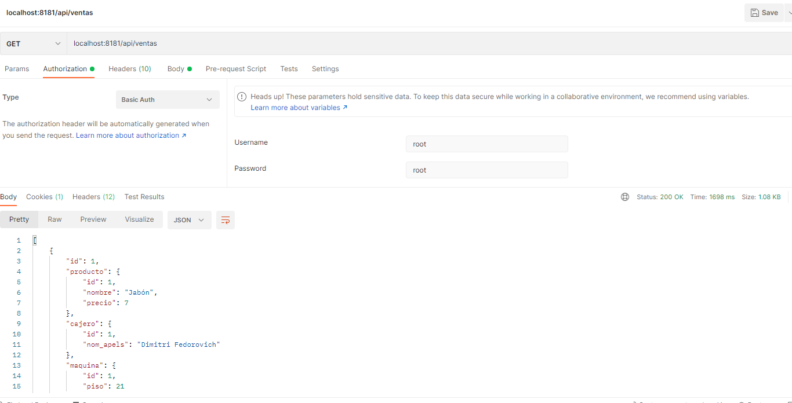

# Java_Bootcamp_Splai_UD27_Spring_Security

Repositorio que cubre la aplicación de la capa de seguridad en múltiples proyectos Spring que implementan MySQL - ER

@author: Isabel Calzadilla

UD27 : SPRING - SECURITY

OBJETIVOS:

- Establecer una capa de seguridad a los proyectos que conectan vía SQL.
- Comprobación del usuario y contraseña para acceder a los registros contenidos en SQL.
- Correcta conexíon a la base de datos.

                                    EJERCICIO 1

                                    COMPROBACIÓN

- Acceso vía usuario y contraseña:

- Registros con credenciales unicamente:

                                    EJERCICIO 2

                                    COMPROBACIÓN

- Acceso vía usuario y contraseña:

- Registros con credenciales unicamente:

                                    EJERCICIO 3

                                    COMPROBACIÓN

- Acceso vía usuario y contraseña:

- Registros con credenciales unicamente:

                                    EJERCICIO 4

                                    COMPROBACIÓN

- Acceso vía usuario y contraseña:

- Registros con credenciales unicamente:

